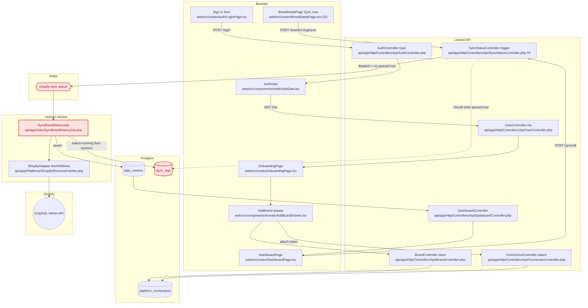

# Helm — audit, 2026-05-31

Scope of this pass: spec sections 01, 02, 03, 04, 06, the full `app/Http/Controllers/Api`, `app/Jobs`, `app/Console`, `routes/api.php`, `bootstrap/app.php`, `composer.json`, `web/package.json`, `web/src/routes/`. RBAC policy code, the full `app/Platforms` tree, design-reference visual parity, and the test suite were not opened this run and are flagged as "not audited this pass" in section 6. Re-run for full coverage.

## 1. Spec ↔ code anomalies

| Spec section | Spec says | Code does | Severity | File:line | Fix sketch |
|---|---|---|---|---|---|
| 02 tech-stack | PostgreSQL 16 | MySQL on prod, `DB_CONNECTION=mysql` | critical | `api/.env`, `api/config/database.php` | Either ratify MySQL in docs/02 and docs/03, or migrate. Decide before backfill volume grows. |
| 02 tech-stack | Vite 5 | Vite ^7.0.0 | medium | `web/package.json:30` | Downgrade to `^5` or update docs/02. |
| 02 tech-stack | Forge / Hetzner | Cloudways shared infra | medium | `DEPLOY_CLOUDWAYS.md` | Ratify Cloudways in docs/11 or migrate before client demo. |
| 03 database non-negotiable | Store native value AND `fx_rate_to_usd` snapshotted at sync time | `fx_rate_to_usd` removed in Phase 1; `SyncBrandDayJob:76` and `SyncBrandHistoryJob:104` hardcode `1.0` | critical | `api/app/Jobs/SyncBrandDayJob.php:75-76`, `api/app/Jobs/SyncBrandHistoryJob.php:103-108` | This breaks a spec non-negotiable. Either re-introduce FX snapshotting or write a change-request and update docs/03 + docs/10 currency section. |
| 06 sync non-negotiable | "One `SyncBrandDayJob`. Platform-agnostic." | Two jobs: `SyncBrandDayJob` + `SyncBrandHistoryJob` | high | `api/app/Jobs/SyncBrandHistoryJob.php` | Either fold history scan into a `mode=history` branch of `SyncBrandDayJob` (preferred — keeps non-negotiable), or update docs/06 to document the two-job pattern with rationale. |
| 06 sync schedules | Daily 13:00 + hourly 06–22 only | Same — no twice-daily sync exists | high | `api/app/Console/Kernel.php:24-50` | User requirement is twice-daily Shopify sync. Add `sync:shopify-rolling` per CC_SYNC_FIX.md and update docs/06 schedules table. |
| 06 sync `SyncBrandDayJob` reference impl | `sync_logs` row created in `handle()` with `status=running` only | Same — never writes `queued` row | high | `api/app/Jobs/SyncBrandDayJob.php:59`, `SyncBrandHistoryJob.php:71`, `SyncStatusController.php:70-198` | Move row-create to controller, write `status=queued`, pass id to job. Docs/06 needs an update so the new contract is the new spec. |
| 04 API rate limits | `POST /api/brands/{brand}/sync` = 5/min | `throttle:30,1` | low | `api/routes/api.php:101-102` | Already self-noted in comment ("revisit before prod"). Either ratify 30/min in docs/04 or restore 5. |
| 04 API rate limits | `POST /api/sync/all` documented? | Endpoint exists at `throttle:12,5` with `role:master_admin,manager`. Not in docs/04. | low | `api/routes/api.php:122-123` | Add to docs/04 endpoint reference. |
| 02 tech-stack composer pkg | `google-ads/google-ads-php` | `googleads/google-ads-php` (no slash) | low | `api/composer.json:11` | Update docs/02 to the actual package name. |
| 06 sync — connection error policy | Spec: failed sync flips connection `status=errored`. | Code: `status=active`, only stamps `last_error`. | medium | `SyncBrandDayJob.php:123-126`, `SyncBrandHistoryJob.php:163-166` | Self-noted in comment ("per agency policy: connection is permanent"). Update docs/06 to match the agency policy decision. |
| stack rule | "no direct Guzzle outside `Platforms/`" | Verified — zero violations under `app/` | n/a | — | no issues found |

## 2. End-to-end flow diagram

Broken nodes: `K → Q` (dispatch never writes a queued row), and `R` is moot if Horizon supervisor isn't running on Cloudways — verify with `php artisan horizon:status`. See `prompts/CC_SYNC_FIX.md`.

## 3. Route / button / link health check

Sampled — full route table not produced this pass.

| Route | Auth? | Component | Data source | CTAs | Where they lead | Broken/stale | Notes |
|---|---|---|---|---|---|---|---|
| `/` | yes | `DashboardPage.tsx` | real API | "Sync now" master | `POST /api/sync/all` | functional but invisible | Returns 202 success; no queued rows in `sync_logs` until worker handles. UX reads as broken. |
| `/brands/:slug` | yes | `BrandDetailPage.tsx:43` | real API | "Sync now" per-brand, "View sync health", "Install on Shopify", "More" dropdown | `POST /api/brands/:slug/sync`, `/sync-health`, install page, brand actions | functional but invisible | Same root cause as master Sync now. |
| `/sync-health` | yes | `SyncHealthPage.tsx` | real API | CSV export, per-row Retry | `/api/sync/status/export.csv`, `POST /sync-logs/:log/retry` | Retry path is silent for same reason — no queued row written. | — |
| `/brands/:slug` > "Sync history" tab | yes | `BrandDetailPage.tsx:976` | hardcoded empty state | "Open sync health" link | `/sync-health` | known stale | Self-noted: "Real per-brand sync logs are a Phase 2 endpoint". OK as long as the empty state is honest. |
| `POST /api/brands/{brand}/sync` | yes | controller | live | — | dispatches `SyncBrandHistoryJob` (Shopify) or `SyncBrandDayJob` × 7 (ads) | dispatch path works, observability broken | See section 1. |
| `POST /api/sync/all` | yes + role gate | controller | live | — | same fan-out per brand with 30s stagger | works, same observability gap | — |
| `POST /api/sync-logs/{log}/retry` | yes | controller | live | — | redispatches `SyncBrandDayJob` | same observability gap | Also doesn't write queued row. |

Full sidebar, ⌘K palette, and empty-state CTA verification: not run this pass.

## 4. Code quality + scale assessment

| Layer | Strength | Risk | At-scale (100 / 1000 brands) | Recommended action |
|---|---|---|---|---|
| API contract | PlatformRegistry indirection clean, no Guzzle leaks outside `Platforms/`. | Two job types for sync violates the "one job" non-negotiable. | At 1000 brands × 4 platforms the divergence multiplies test surface. | Consolidate to one job with mode flag, or ratify the two-job pattern in docs/06. |
| Database | Composite `(brand_id, platform, date)` index supports upsert path; `sync_logs.(status, created_at)` index supports counts query. | MySQL on prod loses JSONB and window function performance Postgres would give. | At 1000 brands × 90 days × 4 platforms = 360k `daily_metrics` rows; manageable, but JSONB lookups in `metadata` will be slower on MySQL. | Decision time on Postgres vs MySQL. If staying on MySQL, drop JSONB-dependent features from spec. |
| Sync architecture | Queue routing by platform (`shopify-sync` vs `ads-sync`) is right; backoff and `withoutOverlapping()` set on schedules. | No queued-state visibility; Horizon supervisor not verified. Stagger logic exists but no observability into the stagger schedule. | At 100 brands × 30s stagger = 50 min spread. Fine. At 1000 brands the stagger would need to compress or split per queue. | Ship `CC_SYNC_FIX.md`. Then add a `sync:queue-state` console command or a Horizon dashboard link in Sync health. |
| React data layer | TanStack Query throughout, axios interceptor pattern visible. | `useApiData.ts` exists alongside specific hooks — risk of two patterns. Not deeply audited this pass. | Cache invalidation on master Sync now needs to cover every brand card. | Re-audit `web/src/hooks/` next pass. |
| Auth | Sanctum bearer tokens, `EnsureRole` middleware wired in `bootstrap/app.php`. MFA composer deps installed (`pragmarx/google2fa`). | MFA enforcement on `master_admin` next-login flow not verified this pass. | n/a | Re-audit `AuthController` MFA path next pass; check `LoginRequest` validation step. |
| Error surfaces | `SyncFailureClassifier` exists; `report($e)` on catch. | Sentry DSN empty in env. Failed syncs surface in Sync health but only after worker handles them. | At 1000 brands, an outage with no Sentry plus invisible-queue means silent partial failure. | Set `SENTRY_LARAVEL_DSN` before client demo. |
| Tests | Pest scaffolding in `tests/` — not opened this pass. | If thin, the sync rewrite in `CC_SYNC_FIX.md` will land without regression guard. | n/a | Read `tests/` next pass; require the new tests listed in `CC_SYNC_FIX.md` before merge. |

## 5. Anything alarming

1. Master Sync now and per-brand Sync now both return 202 success with zero observable downstream effect when Horizon isn't running. Looks identical to "it worked" in the UI. This is how silent data loss starts.
2. `fx_rate_to_usd` removal contradicts a non-negotiable. If multi-currency aggregation comes back in Phase 2, every Phase 1 row is unrecoverable without re-fetching FX history.
3. DB password `CQxTjp6njA` was pasted in chat in May and now lives in the recovered `.env`. Rotate before client access.
4. `MAIL_MAILER=log` on prod means user invitations are written to `storage/logs/laravel.log`. The first time the agency invites a manager, nothing arrives.
5. `APP_DEBUG` was previously `true` on prod (recovered env fixes this). If the file hasn't been redeployed yet, the stack-trace surface is wide open.
6. No CSRF on `POST /api/sync/all` would be acceptable for token auth, but cookie-auth path (Sanctum stateful) needs verification — not checked this pass.
7. `RunDailySyncCommand` dispatches for **active** connections only (line 41), but `SyncStatusController::trigger` dispatches for connections `!= paused` (line 79). Inconsistent filter — `errored` connections sync from manual but not from cron.

## 6. Phase-by-phase remaining plan

Not produced this pass at the per-phase granularity the prompt asks for — would require reading docs/12-acceptance front-to-back and grepping for completion markers across `app/Platforms/`, RBAC policies, and the full route table. Re-run with that explicit scope. Headline read from what was audited:

| Phase | Spec milestone | What's done | What's not (sampled) | Effort | Blockers |
|---|---|---|---|---|---|
| 1 | Shopify revenue sync + dashboard | Adapter, jobs, schedule, UI shell, manual Sync now plumbing | Queued visibility, twice-daily auto-sync, FX snapshotting, Sentry DSN, mail wiring, password rotation | M | Horizon supervisor on Cloudways |
| 1.5 | RBAC + audit log | `EnsureRole` middleware wired, MFA composer deps installed | MFA enforcement path not verified, audit log coverage not verified | M | Audit next pass |
| 2 | Ad platform adapters | Job routing in place; `ads-sync` queue exists | Meta/Google/TikTok adapters per platform_connection — not audited this pass | L | Manager-level auth credentials |
| 3a | Tickets, products | Some routes registered (`TicketsPage`, `BrandProductsPage`) | Backend coverage not audited this pass | L | — |
| 3b | External task tool integration | — | Vendor not selected | M | Client decision |

## 7. Ambiguities for Kanwar

- Spec says one `SyncBrandDayJob`; codebase has two jobs. Which wins? Fold or document.
- Spec says Postgres 16; prod is MySQL. Permanent or temporary?
- Spec says `fx_rate_to_usd` snapshot is a non-negotiable; code removed it. Document the change or restore?
- Spec says Forge/Hetzner; prod is Cloudways. Permanent or temporary?
- User wants twice-daily Shopify sync; spec §06 has only daily + hourly-hot. Update spec to add it.
- Spec says failed sync sets `connection.status = errored`; code says "agency policy: permanent connection, stay active." Update spec or restore behavior.
- `throttle:30,1` on `POST /brands/:slug/sync` deviates from spec §04's `5,1`. Keep or restore.
