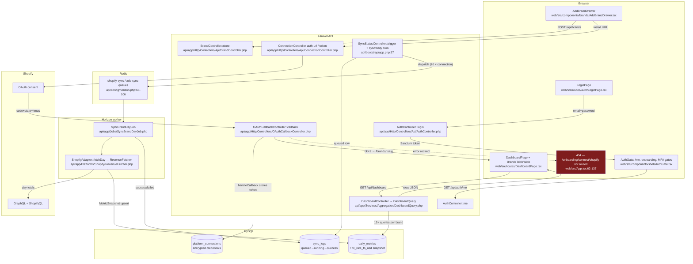

# Helm — full codebase audit — 2026-07-10

Roles: senior system architect, senior UI/UX designer, senior developer. Spec = `docs/00–13`; reality overlay = `docs/AS-BUILT.md` + ADR log D-001..D-017. Ratified deviations (MySQL D-001, Cloudways D-002, 12h sync D-003, total-revenue default D-005/D-006/D-007, "my brands" default D-008, MFA-off kill switch D-009, Roasdriven D-012, incremental delivery D-013) are treated as accepted reality, not anomalies.

Verification stamp: every file:line citation and count in this report was independently re-checked against the working tree on 2026-07-10 (ilike bug, dashboard stubs, FX COALESCE fallback, mock hook chain, unscheduled commands, OAuth 404 path, ErrorBoundary coverage, MFA flag default, Vite 7, 800ms acceptance bar, Horizon worker counts, daily_metrics indexes, 29 test methods, zero Guzzle outside Platforms). Job-count projections are formulas over production data marked as estimates.

## 1. Spec ↔ code anomalies

Case a = code vs spec, no covering ADR. Case b = code vs its own ADR/CR.

| Spec section | Spec says | Code does | Severity | File:line | Case | Fix sketch |
|---|---|---|---|---|---|---|
| §06 + CR 2026-05-31 | Hourly hot-brand sync "stays for top-20 by spend" | `RunHourlySyncCommand` exists but is never scheduled | medium | api/bootstrap/app.php:55-100 | b | Add `sync:hourly` to the schedule or ratify its removal in decisions/README.md |
| §06 + CR 2026-05-31 | `sync:shopify-rolling` (today+yesterday) runs 01:00+13:00 | Only `sync:daily` runs (days −1..−7); "today" is never auto-synced, so today tiles stay stale until a manual sync | medium | api/bootstrap/app.php:57-62, api/app/Console/Commands/RunDailySyncCommand.php:69 | b | Schedule `sync:shopify-rolling` at 01:00/13:00 per the ratified CR |
| D-001 (MySQL) | Code must run on MySQL | `ilike` operator (Postgres-only) in brand search — `GET /api/brands?search=` throws SQL error on MySQL; latent because the SPA filters client-side | medium | api/app/Http/Controllers/Api/BrandController.php:31 | b | Replace `ilike` with `where('name','like',"%{$v}%")` |
| §04 | `/api/brands/{id}/trend` returns daily series; `/api/dashboard/summary` returns totals | Both registered but stubbed: `trend()` returns `[]`, `summary()` returns hardcoded zeros; SPA no longer calls either | medium | api/app/Services/Aggregation/DashboardQuery.php:588-606, api/routes/api.php:71,87 | a | Implement both from `daily_metrics` or delete the routes and update docs/04 |
| §12 Phase 1.5 | "Invited user receives an email with an accept link" | No mail is sent; controller returns `acceptUrl` for manual copy (open question 7, email provider, never decided) | medium | api/app/Http/Controllers/Api/UserController.php:92-102 | a | Pick Postmark/Resend, add an InvitationMail, keep the URL modal as fallback |
| §02 | Sentry "both backend and frontend" | Backend has sentry-laravel; no Sentry package or init in the SPA | medium | web/package.json:1-30 | a | Add @sentry/react with an ErrorBoundary integration |
| §08 / §12 | Impersonation with banner + audit trail | Not built anywhere in api/app; UI admits "still on the Phase 1.5 list" | medium | web/src/routes/UserDetailPage.tsx:360 | a | Build impersonation start/stop endpoints writing `impersonation.*` audit rows |
| §03 phase-1 | `fx_rate_to_usd NOT NULL`, stamped at sync | Made nullable; async `BackfillFxRatesJob` + `fx_pending` metadata flag fill it later | low | api/database/migrations/2026_05_22_000001_make_fx_rate_nullable_on_daily_metrics.php | a | Sound design — add a D-0XX row ratifying nullable FX + backfill |
| §02 stack lock | Vite 5; no unlisted deps | `vite ^7.0.0`; composer adds pragmarx/google2fa + bacon-qr-code (TOTP, unlisted) | low | web/package.json:38, api/composer.json:12-13 | a | Ratify Vite 7 and the two MFA libs in the decisions log |
| §10 / §06 | FX from exchangerate.host; >5% sync-failure email to master admins | Provider is frankfurter.app (exchangerate.host went keyed); failure-digest email never implemented (prefs exist, no sender) | low | api/app/Services/Currency/FxProvider.php:12-20, api/config/sync.php:43 | a | ADR the provider swap; wire a daily digest notification |
| docs/04+06 (post-D-003) | Master sync = full history per brand, 30s stagger | 35-day Shopify window, 3-day ads, no stagger (deliberate, faster) | low | api/app/Http/Controllers/Api/SyncStatusController.php:203-212 | b | Update docs/04 + docs/06 to the shipped windows |

## 2. End-to-end flow diagram

## 3. Route / button / link health check

All sidebar items (Sidebar.tsx:12-121) and ⌘K palette entries (SearchPalette.tsx:18-27) resolve; palette actions open real drawers. No `{todo}` responses exist in any controller (grep clean).

| Route | Auth | Component | Data source | CTAs → where | Broken | Notes |
|---|---|---|---|---|---|---|
| /dashboard | Y | DashboardPage | real /api/dashboard, /dashboard/audience | Master sync → POST /sync/all; empty state → AddBrandDrawer | N | Manager/compare/window filters all wired |
| /sync-health | Y | SyncHealthPage | real /api/sync/status | Retry → POST /sync-logs/{id}/retry; CSV export | N | |
| /brands | Y | BrandsPage | real /api/brands | Add brand → drawer | N | Search is client-side (masks the `ilike` bug) |
| /brands/:slug | Y | BrandDetailPage | real /brands/{slug}, /metrics | Sync now; links to /ads /products /audit | N | |
| /brands/:slug/ads | Y | BrandAdsPage | real overview; **mock brand lookup** | period + platform toggle | Y | mock `useBrand` → platform toggle reflects mock connections, not real ones (BrandAdsPage.tsx:23, useDashboardData.ts:163-167, AdPlatformToggle.tsx:39-42) |
| /brands/:slug/products | Y | BrandProductsPage | **mock rows** | banner admits Phase 2 | Y | hardcoded SKU table via mockApi (BrandProductsPage.tsx:9, useDashboardData.ts:187-189) |
| /brands/:slug/audit | Y | BrandAuditPage | **mock findings** | — | Y | mock audit cards (BrandAuditPage.tsx:21-22, useDashboardData.ts:191-193) |
| /inventory, /ads | Y | InventoryPage, AdsPage | real, but brand list via full `useDashboardData()` | brand switcher | N | reuses heaviest query just for a brand list (InventoryPage.tsx:43) |
| /reports, /brands/:slug/reports/:type, /r/:token | Y/Y/public | Reports pages | real ReportController + share tokens | build/share | N | ReportsPage.tsx:17 same heavy-query reuse |
| /team, /team/users/:slug | Y | TeamPage, UserDetailPage | real /api/users | InviteUserDrawer → POST /invitations | N | invite link copied manually (no email) |
| /audit-log | Y | AuditLogPage | real cursor-paginated /audit-logs | CSV export | N | filter chips are static (AuditLogPage.tsx:150) |
| /settings, /profile, /onboarding | Y | Settings/Profile/Onboarding | real | MFA setup, platform keys, avatar | N | |
| /tickets, /tickets/:id | Y | TicketsPage | none — labeled Phase 3 empty state | NewTicketDrawer = honest placeholder | N | no fake data |
| OAuth error redirects | — | — | — | → /onboarding/connect/shopify | Y | unregistered SPA path → 404 (OAuthCallbackController.php:30-46,67) |

## 4. Code quality + scale assessment

| Layer | Strength | Risk | At-scale (100 / 1,000 brands) | Action |
|---|---|---|---|---|
| API contract | Clean `PlatformAdapter` + registry; zero Guzzle outside app/Platforms; all 4 clients own retry/backoff (Shopify cost-floor sleep ShopifyClient.php:174-193; Meta codes+header MetaClient.php:32,153-185; TikTok 40100 TikTokClient.php:92-94; Google SDK) | `sleep()` in workers blocks a slot up to 30s | 100 OK; at 1,000 sleeps cap throughput of 8+4 workers | Move throttle waits to job `release()` with delay |
| Database | Spec indexes present: unique(brand,platform,date) + (date,brand) + (brand,date,platform) (2026_01_01_000004:40-42); additive-only migrations; FX snapshot per row | `BrandController::metrics` loads a brand's entire `daily_metrics` history unbounded (BrandController.php:230-233) | fine at 100; memory creep as history × platforms grows | Cap to a date window or aggregate in SQL |
| Sync architecture | One job, queue routing shopify-sync(8)/ads-sync(4) (SyncBrandDayJob.php:66, horizon.php:68-106), queued-row visibility, 30-min idempotency, 3 tries 1m/5m/15m | `sync:daily` = brands × active connections × 7 jobs, twice daily; each Shopify success also runs funnel+commerce ShopifyQL sub-syncs inline (SyncBrandDayJob.php:149-181) | 100 brands ≈ 1,400 jobs/run at ~2 connections each (estimate — formula: brands × connections × 7); 1,000 brands ≈ 14,000/run at the same mix, 28,000 with all four platforms — hours per run at 12 workers | Split hot/cold cadence; batch ads via account-level range queries |
| React data layer | TanStack Query keys well-designed; axios bearer + 401 event + envelope unwrap (lib/api.ts:16-52) | mockApi still feeds 3 brand subpages + dead `useAuth` hook; tables render every row unvirtualized (BrandsTableWide.tsx:136) | 100 rows OK; 1,000-row DOM will jank, and dashboard payload has no pagination | Delete mock hooks, port pages to real endpoints, virtualize |
| Auth/RBAC | Global scope (Brand.php:120-132) + `access.brand` middleware + policies + role middleware = spec's belt-and-suspenders | MFA enforcement shipped but killed off (`HELM_REQUIRE_ADMIN_MFA=false`, config/helm.php:20, per D-009) | n/a | Fix server NTP, flip the flag |
| Error surfaces | Toast store used consistently; amber/`—` missing-data rules enforced server-side (DashboardQuery.php:159-169,285-348) | ErrorBoundary wraps only /onboarding + settings tabs (App.tsx:83, SettingsPage.tsx:26-32) — a render error white-screens the dashboard | worse with more data variety | Wrap AppLayout children in ErrorBoundary |
| Tests/CI | CI runs PHPUnit on push (.github/workflows/api-ci.yml) | 6 test files, 29 test methods; zero coverage of DashboardQuery, SyncBrandDayJob, adapters, FX; no frontend tests, no web job in CI | regressions land silently on a live daily-use product | Add feature tests for dashboard math + sync lifecycle first |

**The headline scale problem:** `DashboardQuery::run()` executes ~12 queries per brand (2 day rows + 6 ad rows + 4 window aggregates, DashboardQuery.php:107-256) plus 4 per enabled comparison period — verified: the per-brand closure at line 107 calls `shopifyRow()` ×2 and `adRow()` ×6 per brand. At 80 brands that is ~960 queries per dashboard load; at 1,000 brands ~12,000. The §12 bar "100 brands in 800ms cold" (docs/12-acceptance/README.md:15) is unlikely to hold today. Rewrite as set-based queries (GROUP BY brand_id with conditional aggregates) — MySQL 8 handles this fine.

## 5. Anything alarming

- **Production secrets are tracked in git** (found in the verification pass, invisible to a working-tree read): `.env.production.recovered` — APP_KEY, DB_PASSWORD, REDIS_PASSWORD, AWS keys, Sentry DSN — is in `git ls-files` and on origin. Root `.gitignore` covers `/api/.env*` but not this root-level file. Rotate every value, `git rm --cached`, ignore it; rotation matters more than history purging. Note APP_KEY rotation requires re-encrypting TokenVault payloads (app/Services/Encryption/TokenVault.php).
- Dashboard N+1 (above) is the single biggest scale cliff; it also silently taxes /reports and /inventory, which reuse the same query for a brand list.
- Production worker mode is ambiguous: bootstrap/app.php:48 says "queue:work cron drains them" while DEPLOY_CLOUDWAYS.md:352-382 prefers Supervisord Horizon. If a single `queue:work` cron is what actually runs, the 8/4/4/2 concurrency model does not exist and sync runs serialize.
- Master admin has no MFA in production since 2026-06-01 (flag off per D-009) and invitation links travel by manual copy-paste — combined, account takeover risk on a revenue system.
- "Today" Shopify data never auto-syncs (anomaly 2); the brand page today tile and any intraday check depends on someone clicking Sync now.
- USD mode falls back to rate 1.0 for un-backfilled rows (`COALESCE(fx_rate_to_usd, 1)`, DashboardQuery.php:80-88) — an AED brand pending FX renders 3.67× overstated in USD, with no amber signal.
- 29 test methods guard a live system syncing ~80 brands; the highest-stakes rules (missing-data-not-zero, refund attribution) have no explicit tests despite docs/10 demanding it.
- `SyncBrandDayJob` sub-syncs (campaign, breakdown, funnel, commerce) swallow their own errors by design — granular report tables can silently go stale while sync health shows green.
- No frontend error tracking (no Sentry in SPA) — client-side breakage is invisible unless Bosco reports it.
- 134 of 146 commits are titled "a" — `git log` is useless for bisecting or auditing what changed when, on a production system.

## 6. Phase-by-phase remaining plan

Completion percentages are judgment calls grounded on the named done/not-done lists.

| Phase | Spec milestone | Actually done | Not done | Effort | Blockers |
|---|---|---|---|---|---|
| 1 — dashboard | ~90% | Auth, brand CRUD, Shopify e2e (token + OAuth), all 4 adapters, 12h sync + manual + retry + CSV, FX/USD, tz-aware dates, amber rules, drill-in metrics, backfills | Hourly hot-brand schedule; today auto-sync; QTD/custom ranges; trend/summary endpoints; 800ms@100-brands perf bar | M | none |
| 1.5 — RBAC | ~85% | Roles, global scope + middleware + policies, invites + accept flow, brand_user_access UI, audit log + export, MFA built | Invitation email, impersonation, MFA enforcement flip | M | email provider decision (open q.7); server NTP |
| 2 — deep analytics | ~55% | Ads hub (campaign/creative/audience, Meta deep + Google/TikTok breadth), reports + public shares (D-014), inventory intelligence, commerce/funnel granular tables | Product performance page (mock), store audit cards (mock), spec's underperformer/scale-candidate flag rules, ad-set level | L | D-016 LLM decision for report narrative; TikTok BC token |
| 3a — ticketing | 0% | Honest placeholders only (no tables, no endpoints) | Everything | L | client priority call under D-013 |
| 3b — task tool sync | 0% | Nothing | Everything | M | tool choice (open q.8) |

## 7. Ambiguities for Kanwar

- Is production running Horizon under Supervisord or the cron `queue:work` fallback? bootstrap/app.php:48 and DEPLOY_CLOUDWAYS.md:352 disagree — this decides whether queue concurrency is real.
- CR 2026-05-31 ratified keeping `sync:shopify-rolling` + `sync:hourly`, yet neither is scheduled — confirm whether their removal was decided or forgotten.
- The dashboard dropped spec §12's MTD/QTD/custom ranges for yesterday/day-before/rolling 7-30-90 + YoY — Bosco-driven per D-013, but no ADR row says the spec ranges are dead.
- `/api/dashboard/summary` and `/brands/{id}/trend` are stubs on live routes — implement or delete?
- MFA enforcement (D-009) has been "pending NTP" for three weeks — who owns flipping `HELM_REQUIRE_ADMIN_MFA`?
- Sweden/EUR exclusion (docs/README non-negotiable) has config but no consuming aggregation — does any current view need it, or should it be marked dormant?
